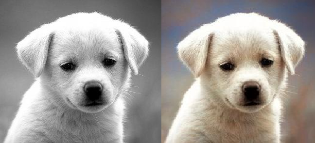

# Image Colorization

- *Image colorization* (tô màu ảnh) là quá trình khôi phục hoặc thêm màu sắc cho các bức ảnh đen trắng hoặc bị mất màu.

## Phương pháp tiếp cận

- **CNN**: Sử dụng kiến trúc **encoder-decoder** để trích xuất đặc trưng và tái tạo hình ảnh.
- **Conditional GAN** và **DCGAN**: Hai biến thể của mạng GAN truyền thống, được tối ưu hóa cho bài toán tô màu ảnh.

## Bộ dữ liệu

- Tổng hợp từ ba nguồn: **ImageNet 1000**, **100 Sports Image Classification**, và **CelebA-HQ**.
- Ảnh được chuyển đổi sang không gian màu **Lab**, loại bỏ các ảnh grayscale.

*Chi tiết về các phương pháp được trình bày trong file `Report.pdf`*

---------

# Demo

## Hướng dẫn cài đặt và chạy demo

1. **Cài đặt thư viện cần thiết**:  
    Chạy lệnh sau để cài đặt các thư viện yêu cầu:  
    ```bash
    pip install -r requirements.txt
    ```

2. **Chạy ứng dụng**:  
    Sử dụng lệnh sau để khởi chạy ứng dụng:  
    ```bash
    python app.py
    ```

3. **Tùy chỉnh mô hình**:  
    Thay đổi mô hình sử dụng bằng cách chỉnh sửa file `app.py`.

    Tải trọng số của mô hình tại đường dẫn sau: 

4. **Xem kết quả**:  
    Kết quả sẽ được lưu trong thư mục `static/outputs`.
    <p align="center">
        
    </p>

